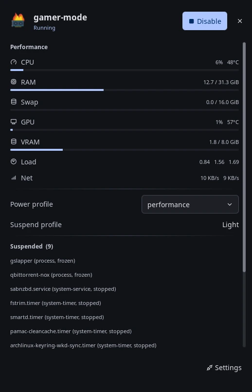

# gamer-mode

Show live CPU, RAM, and GPU numbers in the bar. Suspend background resource hogs
with one click, then restore what was running before.

> Requires Noctalia v5 and plugin API 19. Noctalia v4 uses a different QML
> plugin format and will not list or load this source.



The panel with gamer mode running.

Metrics come from the shell's own system monitor, which reads NVIDIA cards
through NVML in process. The plugin spawns nothing per poll, and AMD and Intel
GPUs work wherever the shell reports them.

## Requirements

- `pgrep` and `pkill` from procps handle process targets
- `systemctl` handles service and timer targets
- `pkexec` and a polkit authentication helper authorise system units, once per
  enable rather than once per unit
- `docker` handles container targets
- `powerprofilesctl` from power-profiles-daemon switches the power profile

Each tool matters only if you target that kind. A missing tool disables the
matching feature and writes a log line.

## Install

Add this repository as a custom plugin source:

1. Open **Settings → Plugins → Sources**.
2. Choose **Add custom repository**.
3. Enter `https://github.com/Nomadcxx/noctalia-gamermode`.
4. Open **Settings → Plugins → Install** and select **Gamer Mode**.

Then open **Settings → Bar**, choose a widget section, select Add Widget, and add
**Gamer Mode**.

Or do the same from a shell:

```sh
noctalia msg plugins source add gamermode git https://github.com/Nomadcxx/noctalia-gamermode
noctalia msg plugins enable nomadcxx/gamer-mode
```

Pull a newer version with `noctalia msg plugins update <source-name>`, then run
`enable` again to re-export it.

The panel also carries three one-shot cleanups: clear shader caches, drop the
page cache, reclaim swap. None of them is part of gamer mode and none is undone
by turning it off.

See the [plugin README](gamer-mode/README.md) for the target list format,
configuration, commands, and runtime side effects.

## Tests

Run the suite from the repository root:

```sh
./run-tests.sh
```

## License

MIT
