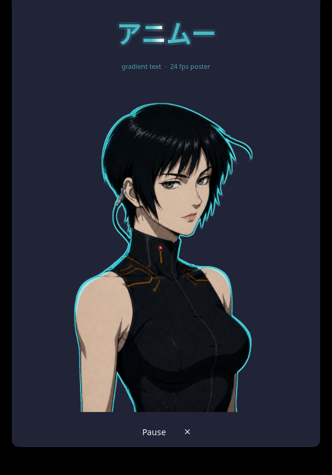

# Animoo

A demonstration plugin for Noctalia's native gradient text. It exists to show the
feature working in a real bar and panel, not to be a useful widget.

Requires **plugin API 28**.

## What it demonstrates

- `ui.label` painted by a four-stop gradient masked through the shaped glyphs
- native motion on that gradient, driven by the shell's animation clock
- a bounded halo (`glowRadius`) around gradient ink
- a panel frame loop that keeps its textures resident and renders only on change

The bar shows `アニムー` in dim cyan with a narrow ice-white crest travelling
through the glyphs. There is no backing rail or pill: the moving light inside the
letterforms is the entire visual. Clicking it opens the panel.

## Motion policy

The wordmark and the panel heading are native gradients, so they follow Noctalia's
reduced-motion setting automatically — they park at the midpoint of their travel
rather than stopping mid-sweep.

The portrait loop cannot. Noctalia does not expose its motion policy to plugin Lua,
so the panel provides a visible pause control instead of pretending to follow a
setting it cannot read. Pausing returns the portrait to its neutral frame.

## Artwork

The eleven portrait frames under `assets/` are original material generated for this
project. Frame 1 defines the character, lighting, crop and costume; the other ten
are edits and in-betweens of that reference, changing only the eyes, the breath and
a strand or two. They are not derived from any existing character, logo or poster.

The clinical cyberpunk mood is a genre reference, nothing more. No franchise
character design, wordmark, title treatment or poster geometry is reproduced here.
